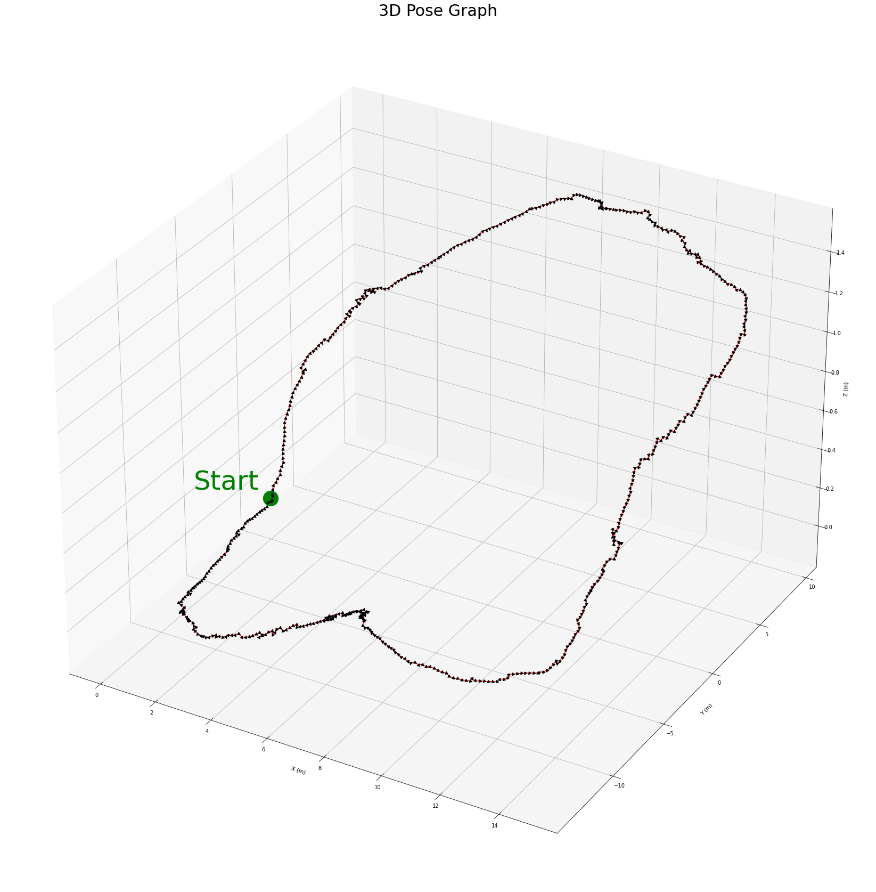

# 3D Reconstruction from Stereo Pair

The objective of this program was to perform visual odometry only using a single camera.

The input data is frames from a video of a pedestrian with a camera walking the perimeter of a building. The first frame is shown below.

## Step 1: Feature matching
Features were detected in each frame using ORB and matched with the next frame using a brute-force matcher. An example of these matches is shown below.

## Step 2: Estimate motion
The trajectory between consecutive frames was estimated using the essential matrix. The motion is represented with a rotation matrix and translation vector.

## Step 3: Close the loop
In an additional step borrowed from SLAM, the trajectory loop was closed. The final frame of the video was matched to the first to create a loop ending at the first frame. The trajectories were adjusted accordingly.

Pose graphs both in 3D and in the xy-plane are shown below. There is also a plot of the elevation in each frame.

